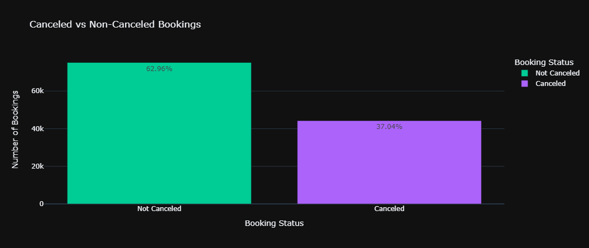
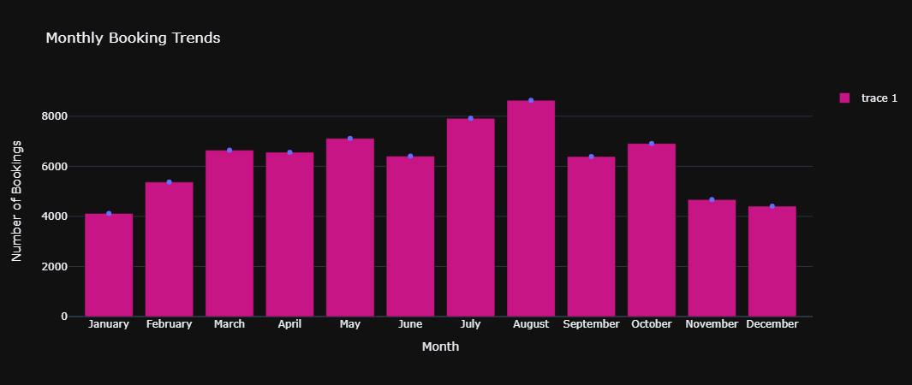
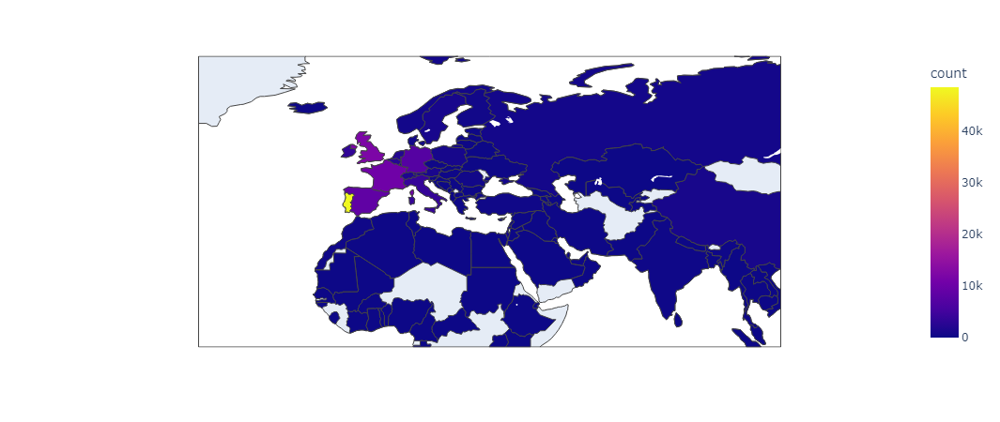
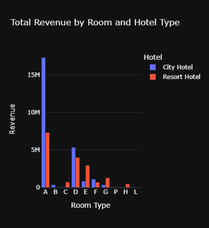
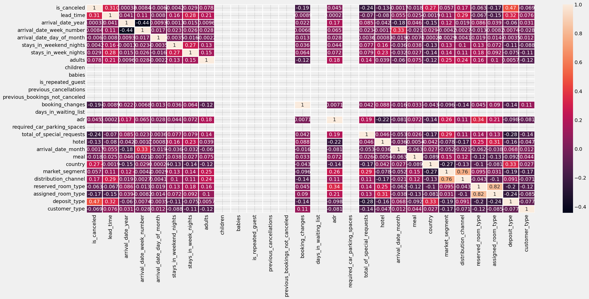
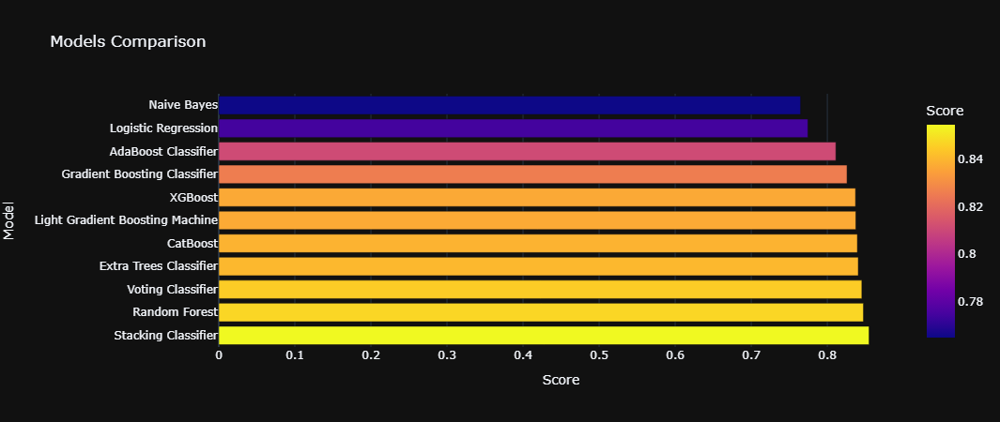

# Hotel Booking Prediction

## How to use

```
pip install -r requirements.txt
```

## Problem Description

Hotel Cancellation Prediction with Machine Learning

- Actionable insights for hotels
- Predict cancellations to:
  - Offer discounts and prevent revenue loss
  - Adjust staffing and optimize costs

## Project Pipeline


## Exploratory Data Analysis

### Cancelled vs. Not Canceled:




### First Observation:

- The majority of reservations occur in the months of July and August, while the fewest bookings are made at the start and close of the year.



### Second Observation:

- City Hotels have more monthly bookings and overall bookings than Resort Hotels.
- Both hotels have the fewest guests during the winter.


### Third Observation:

- The number of guests from  Portugal is significantly  higher than the other  countries. 
- Portugal, Great Britain and  France account for 50% of  the guests. 



### Fourth Observation:

- This plot clearly shows that prices in the Resort Hotel are much higher during the summer and prices of city hotel varies less.


### Fifth Observation:

- City hotels generate higher  revenues compared to  resort hotels across all room  types.  
- Room type A are the most  profitable for both city and  resort hotels. 



### Sixth Observation:

- There is a great loss over the years in the revenue due to cancellations for both city and resort hotels, but it is more obvious in the city hotels significantly.


## Preprocessing

### Handling Missing Values:

- Get percentage of missing values in each column. 
- Drop the columns ‘agent and company’. 
- Drop the rows   


## Feature Engineering

### Preventing Data Leakage

- The `reservation_status` and `reservation_status_date` columns should be dropped because they provide information about when the booking was canceled or when the customer checked out of the hotel.

### Encoding the categorical columns and discretizing the numerical columns

- Encoding Categorical Columns
- Discretizing Numerical Columns

## Feature Selection

### Analyzing the correlation between the target variable and the independent features  



## Model Development



## Unsuccessful Trials

### ANOVA:
- Assumes continuous target variables and may not provide meaningful insights when applied to binary outcomes.

- Inappropriate for capturing the relationship between categorical predictors and binary targets, leading to ineffective feature selection.

## Naïve Bayes Classifier

### Prior Probabilities:

1. ### Mapper:

  ` Output: [(c0, 1), (c1, 1), (c0, 1), (c0, 1), (c1, 1)]`

2. ### Reducer: (by key)

  ` Output: [(c0, 3), (c1, 2)]`


### Likelihood Probabilities:

1. ### Mapper: 

` Output: [(c0, (f1, v1, 5)), (c0, (f1, v2, 10)), (c1, (f1, v1, 2))]`

2. ### Reducer1: 

` Output: [(c0, (f1, v1, 50)), (c0, (f1, v2, 45)), (c1, (f1, v1, 36))]`

3. ### Reducer2: 

` Output: [(c0, (f1, v1, 50, 100)), (c0, (f1, v2, 45, 100)), (c1, (f1, v1, 36, 80))]`

4. ### Reducer3: 

` Output: [(c0, (f1, v1, 50/100)), (c0, (f1, v2, 45/100)), (c1, (f1, v1, 36/80))]`

## Contributors:
- Ahmed Emad
- Hla Hany
- Yomna Osama
- Youssef Mohamed


